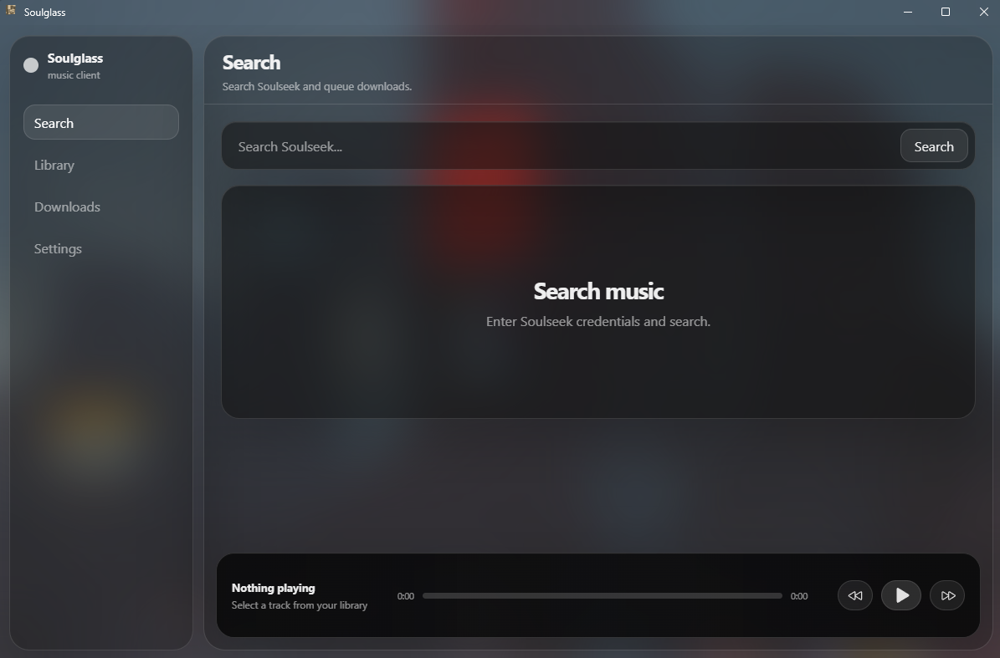
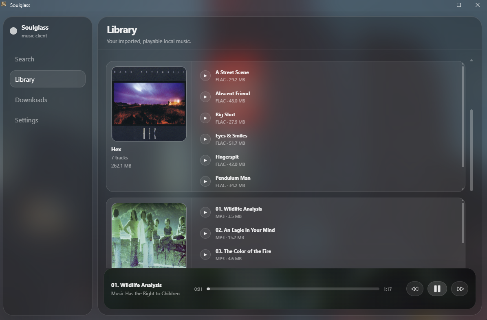
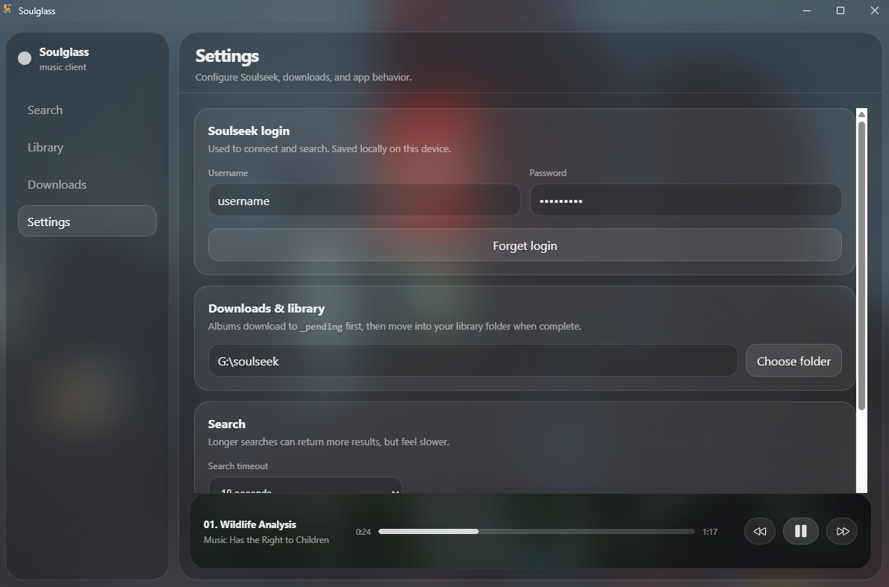

# Soulglass 
A minimal SoulSeek client written in Rust. Uses [Tauri](https://github.com/tauri-apps/tauri) and [soulseek-rs](https://github.com/michel/soulseek-rs).

## Screenshots

## Usage
1) Clone this repository
`` git clone https://github.com/p-marb/Soulglass.git ``
2) Install dependencies
`` npm install ``
3) Run the app in development mode
`` npm run tauri dev ``
4) Build the app
`` npm run tauri build ``

On first launch, enter your Soulseek credentials in the settings page.

## Requirements
- Rust
- Tauri
